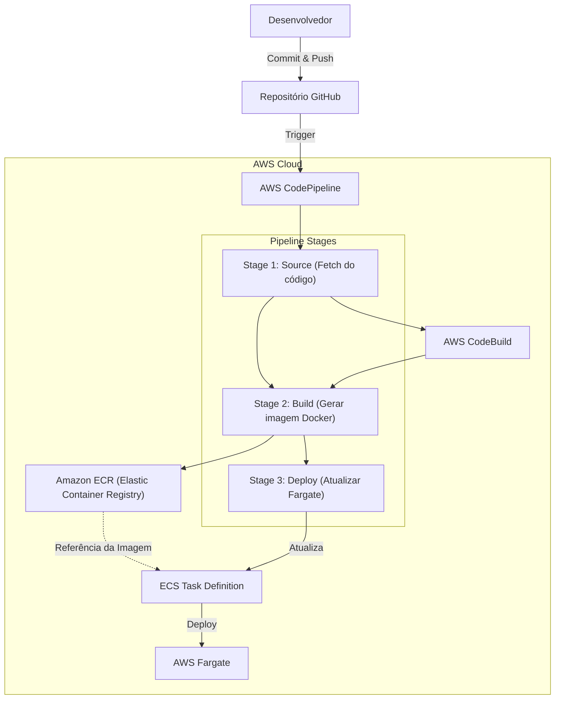

# [Unifor] Computação em Nuvem

## Descrição do fluxo CI/CD / Diagrama da arquitetura

```mermaid
flowchart TB
    Developer["Desenvolvedor"] -->|Commit & Push| GitRepo["Repositório GitHub"]


        direction TB
        GitRepo -->|Trigger| Pipeline["AWS CodePipeline"]
    subgraph "AWS Cloud"
        subgraph "Pipeline Stages"
            direction LR
            Stage1["Stage 1: Source (Fetch do código)"] --> Stage2["Stage 2: Build (Gerar imagem Docker)"]
            Stage2 --> Stage3["Stage 3: Deploy (Atualizar Fargate)"]
        end

        Pipeline --> Stage1

        Stage1 --> CodeBuild["AWS CodeBuild"]
        CodeBuild --> Stage2

        Stage2 --> ECR["Amazon ECR (Elastic Container Registry)"]

        ECR -.->|Referência da Imagem| TaskDef["ECS Task Definition"]
        Stage3 -->|Atualiza| TaskDef

        TaskDef -->|Deploy| Fargate["AWS Fargate"]
    end
```
