# [Unifor] Computação em Nuvem

Repositório dedicado à disciplina ***Computação em Nuvem***, ministrada pelo professor Marcondes Josino Alexandre na Especialização em Engenharia de Software com DevOps, curso de pós-graduação lato sensu da Universidade de Fortaleza (UNIFOR).

## Atividade avaliativa

### Equipe

- Ismália Dulce Gonçalves Santiago (2328703)
- João Victor de Andrade Mesquita (2416898)
- Pedro Luiz Loureiro Maia Silva (2328034)

### Projeto: AutoDeployment

AutoDeployment é uma aplicação web simples escrita em Python (Flask). Foi desenvolvida para servir de demonstração da utilização de contêineres na nuvem. Ideal para cenários onde a automação da implantação é essencial, proporcionando uma solução rápida e leve para executar e implantar na forma de teste de deploy.

### Descrição do fluxo CI/CD / Diagrama da arquitetura

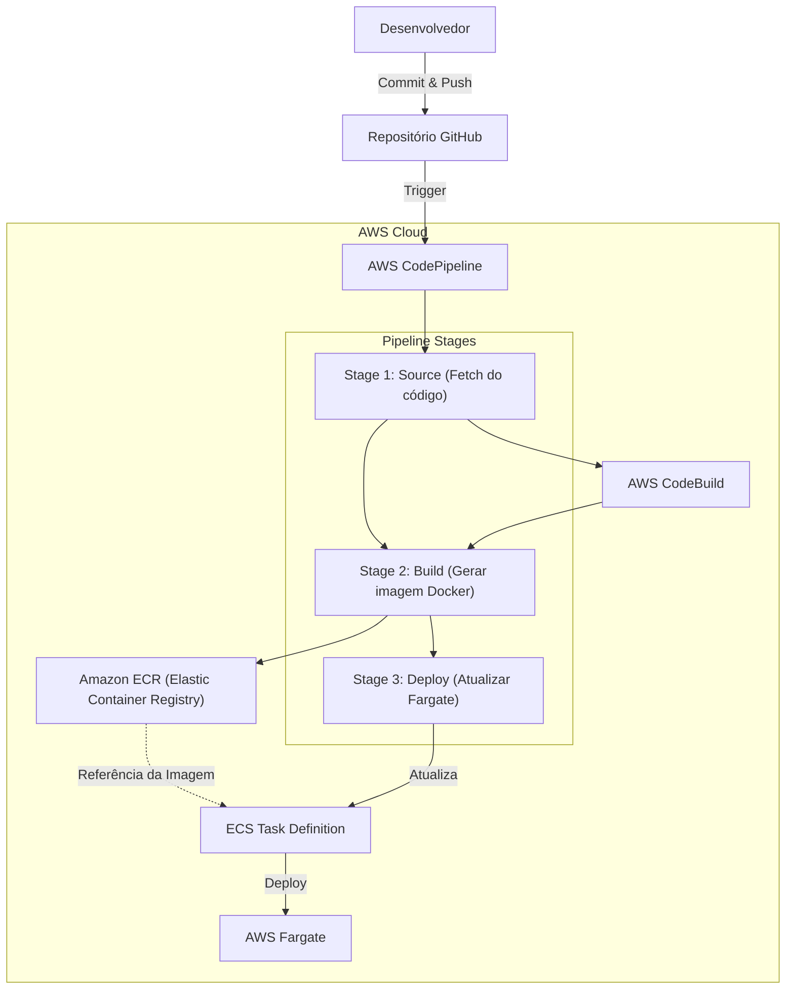

### Prints das configurações do pipeline

#### Construção da Aplicação: AWS CodeBuild

##### Configuration

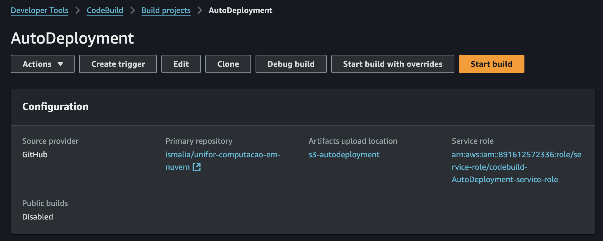

##### Project configuration

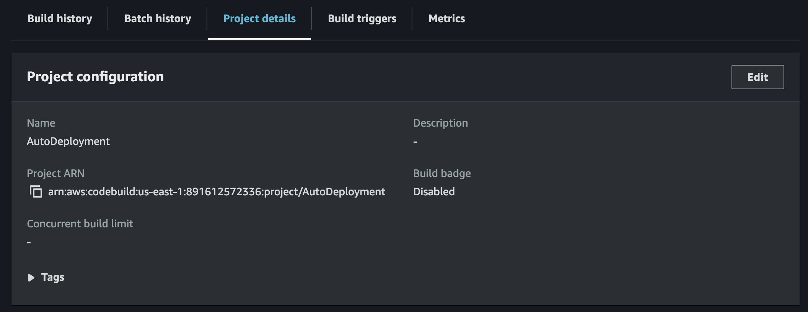

##### Source

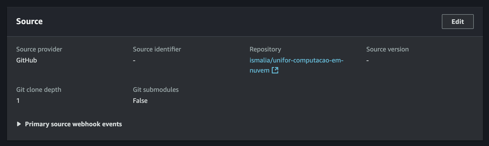

##### Environment

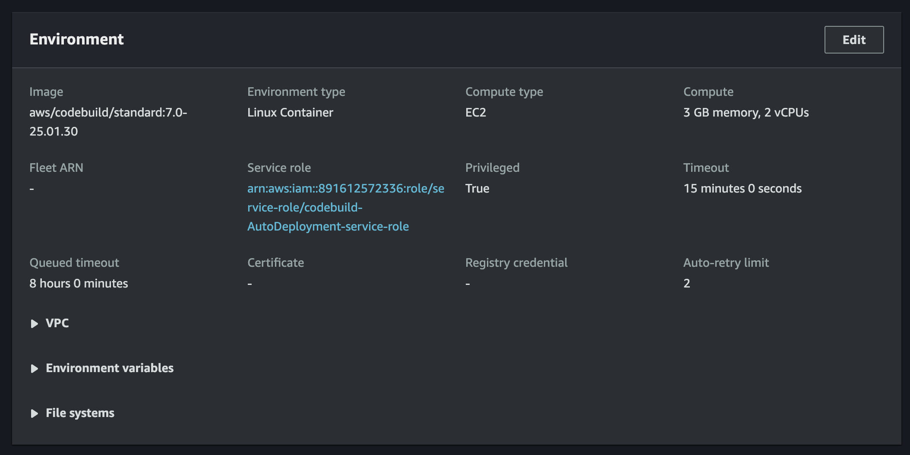

##### Buildspec

- [buildspec.yml](atividade-avaliativa/buildspec.yml)

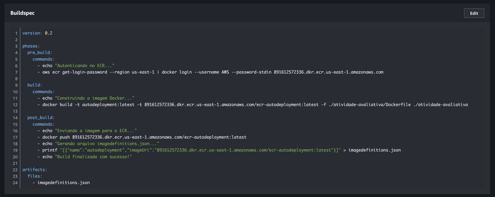

##### Batch configuration

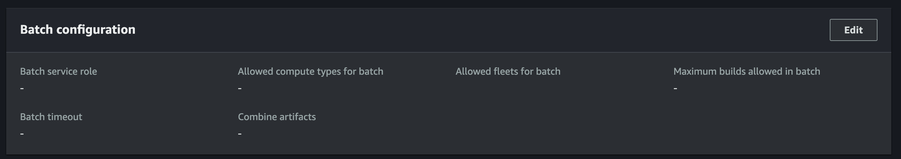

##### Artifacts

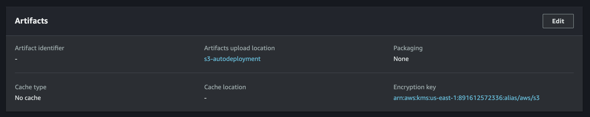

##### Logs

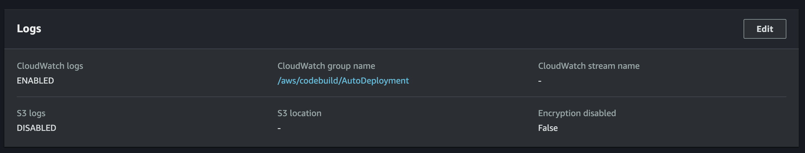

```log
[Container] 2025/03/08 23:03:46.050806 Running on CodeBuild On-demand
[Container] 2025/03/08 23:03:46.050819 Waiting for agent ping
[Container] 2025/03/08 23:03:46.152081 Waiting for DOWNLOAD_SOURCE
[Container] 2025/03/08 23:03:46.519466 Phase is DOWNLOAD_SOURCE
[Container] 2025/03/08 23:03:46.556375 CODEBUILD_SRC_DIR=/codebuild/output/src2428973094/src
[Container] 2025/03/08 23:03:46.556961 YAML location is /codebuild/readonly/buildspec.yml
[Container] 2025/03/08 23:03:46.559473 Setting HTTP client timeout to higher timeout for S3 source
[Container] 2025/03/08 23:03:46.559622 Processing environment variables
[Container] 2025/03/08 23:03:46.635992 No runtime version selected in buildspec.
[Container] 2025/03/08 23:03:46.648745 Moving to directory /codebuild/output/src2428973094/src
[Container] 2025/03/08 23:03:46.648845 Cache is not defined in the buildspec
[Container] 2025/03/08 23:03:46.648855 Cache is not defined in the buildspec
[Container] 2025/03/08 23:03:46.685562 Unable to initialize cache download: no paths specified to be cached
[Container] 2025/03/08 23:03:46.685653 Configuring ssm agent with target id: codebuild:90e276be-3cf7-4b7d-87ea-4bc46161af54
[Container] 2025/03/08 23:03:46.685954 Successfully updated ssm agent configuration
[Container] 2025/03/08 23:03:46.686373 Registering with agent
[Container] 2025/03/08 23:03:46.721167 Phases found in YAML: 3
[Container] 2025/03/08 23:03:46.721188  PRE_BUILD: 2 commands
[Container] 2025/03/08 23:03:46.721194  BUILD: 2 commands
[Container] 2025/03/08 23:03:46.721197  POST_BUILD: 5 commands
[Container] 2025/03/08 23:03:46.721554 Phase complete: DOWNLOAD_SOURCE State: SUCCEEDED
[Container] 2025/03/08 23:03:46.721568 Phase context status code:  Message: 
[Container] 2025/03/08 23:03:46.790021 Entering phase INSTALL
[Container] 2025/03/08 23:03:46.835120 Phase complete: INSTALL State: SUCCEEDED
[Container] 2025/03/08 23:03:46.835138 Phase context status code:  Message: 
[Container] 2025/03/08 23:03:46.871736 Entering phase PRE_BUILD
[Container] 2025/03/08 23:03:46.906355 Running command echo "Autenticando no ECR..."
Autenticando no ECR...

[Container] 2025/03/08 23:03:46.910210 Running command aws ecr get-login-password --region us-east-1 | docker login --username AWS --password-stdin 891612572336.dkr.ecr.us-east-1.amazonaws.com
WARNING! Your password will be stored unencrypted in /root/.docker/config.json.
Configure a credential helper to remove this warning. See
https://docs.docker.com/engine/reference/commandline/login/#credential-stores

Login Succeeded

[Container] 2025/03/08 23:03:49.569615 Phase complete: PRE_BUILD State: SUCCEEDED
[Container] 2025/03/08 23:03:49.569633 Phase context status code:  Message: 
[Container] 2025/03/08 23:03:49.616090 Entering phase BUILD
[Container] 2025/03/08 23:03:49.617323 Running command echo "Construindo a imagem Docker..."
Construindo a imagem Docker...

[Container] 2025/03/08 23:03:49.621332 Running command docker build -t autodeployment:latest -t 891612572336.dkr.ecr.us-east-1.amazonaws.com/ecr-autodeployment:latest -f ./atividade-avaliativa/Dockerfile ./atividade-avaliativa
#0 building with "default" instance using docker driver

#1 [internal] load build definition from Dockerfile
#1 transferring dockerfile: 443B done
#1 DONE 0.0s

#2 [internal] load metadata for docker.io/library/python:3.9-slim-buster
#2 DONE 0.3s

#3 [internal] load .dockerignore
#3 transferring context: 2B done
#3 DONE 0.0s

#4 [internal] load build context
#4 transferring context: 213.95kB done
#4 DONE 0.0s

#5 [1/7] FROM docker.io/library/python:3.9-slim-buster@sha256:320a7a4250aba4249f458872adecf92eea88dc6abd2d76dc5c0f01cac9b53990
#5 resolve docker.io/library/python:3.9-slim-buster@sha256:320a7a4250aba4249f458872adecf92eea88dc6abd2d76dc5c0f01cac9b53990 0.0s done
#5 sha256:824416e234237961c9c5d4f41dfe5b295a3c35a671ee52889bfb08d8e257ec4c 2.78MB / 2.78MB 0.1s done
#5 sha256:8d53da26040835f622504d7762fad14d226ac414efeb5363f5febebc89ff224d 0B / 11.04MB 0.1s
#5 sha256:84c8c79126f669beec1dcf6f34cd88094471745570c19c29b465dfa7db1fdabd 0B / 243B 0.1s
#5 sha256:320a7a4250aba4249f458872adecf92eea88dc6abd2d76dc5c0f01cac9b53990 988B / 988B done
#5 sha256:d5cca64dca485c37ccf06721e36a93bf4331b0404bfd3ef2c7873867965359b7 1.37kB / 1.37kB done
#5 sha256:c84dbfe3b8deeb39e17d121220107f8354a9083b468a320a77708cd128f11c87 6.82kB / 6.82kB done
#5 sha256:8b91b88d557765cd8c6802668755a3f6dc4337b6ce15a17e4857139e5fc964f3 7.34MB / 27.14MB 0.1s
#5 sha256:8d53da26040835f622504d7762fad14d226ac414efeb5363f5febebc89ff224d 3.15MB / 11.04MB 0.2s
#5 sha256:84c8c79126f669beec1dcf6f34cd88094471745570c19c29b465dfa7db1fdabd 243B / 243B 0.1s done
#5 sha256:8b91b88d557765cd8c6802668755a3f6dc4337b6ce15a17e4857139e5fc964f3 16.78MB / 27.14MB 0.2s
#5 sha256:2e1c130fa3ec1777a82123374b4c500623959f903c1dd731ee4a83e1f1b38ff2 0B / 3.14MB 0.2s
#5 sha256:8d53da26040835f622504d7762fad14d226ac414efeb5363f5febebc89ff224d 11.04MB / 11.04MB 0.3s done
#5 sha256:8b91b88d557765cd8c6802668755a3f6dc4337b6ce15a17e4857139e5fc964f3 27.14MB / 27.14MB 0.3s
#5 sha256:2e1c130fa3ec1777a82123374b4c500623959f903c1dd731ee4a83e1f1b38ff2 3.14MB / 3.14MB 0.3s done
#5 extracting sha256:8b91b88d557765cd8c6802668755a3f6dc4337b6ce15a17e4857139e5fc964f3
#5 sha256:8b91b88d557765cd8c6802668755a3f6dc4337b6ce15a17e4857139e5fc964f3 27.14MB / 27.14MB 0.3s done
#5 extracting sha256:8b91b88d557765cd8c6802668755a3f6dc4337b6ce15a17e4857139e5fc964f3 1.1s done
#5 extracting sha256:824416e234237961c9c5d4f41dfe5b295a3c35a671ee52889bfb08d8e257ec4c 0.1s
#5 extracting sha256:824416e234237961c9c5d4f41dfe5b295a3c35a671ee52889bfb08d8e257ec4c 0.1s done
#5 extracting sha256:8d53da26040835f622504d7762fad14d226ac414efeb5363f5febebc89ff224d 0.1s
#5 extracting sha256:8d53da26040835f622504d7762fad14d226ac414efeb5363f5febebc89ff224d 0.4s done
#5 extracting sha256:84c8c79126f669beec1dcf6f34cd88094471745570c19c29b465dfa7db1fdabd done
#5 extracting sha256:2e1c130fa3ec1777a82123374b4c500623959f903c1dd731ee4a83e1f1b38ff2
#5 extracting sha256:2e1c130fa3ec1777a82123374b4c500623959f903c1dd731ee4a83e1f1b38ff2 0.2s done
#5 DONE 2.3s

#6 [2/7] RUN pip install --upgrade --default-timeout=100 pip -i https://www.piwheels.org/simple
#6 1.633 Looking in indexes: https://www.piwheels.org/simple
#6 1.634 Requirement already satisfied: pip in /usr/local/lib/python3.9/site-packages (23.0.1)
#6 2.033 Collecting pip
#6 2.114   Downloading https://www.piwheels.org/simple/pip/pip-25.0.1-py3-none-any.whl (1.8 MB)
#6 2.588      ━━━━━━━━━━━━━━━━━━━━━━━━━━━━━━━━━━━━━━━━ 1.8/1.8 MB 3.9 MB/s eta 0:00:00
#6 2.628 Installing collected packages: pip
#6 2.628   Attempting uninstall: pip
#6 2.629     Found existing installation: pip 23.0.1
#6 2.731     Uninstalling pip-23.0.1:
#6 2.845       Successfully uninstalled pip-23.0.1
#6 3.685 Successfully installed pip-25.0.1
#6 3.686 WARNING: Running pip as the 'root' user can result in broken permissions and conflicting behaviour with the system package manager. It is recommended to use a virtual environment instead: https://pip.pypa.io/warnings/venv
#6 DONE 4.9s

#7 [3/7] WORKDIR /app
#7 DONE 0.0s

#8 [4/7] COPY src/requirements.txt .
#8 DONE 0.0s

#9 [5/7] RUN pip install --default-timeout=100 --no-cache-dir -r requirements.txt -i https://pypi.tuna.tsinghua.edu.cn/simple
#9 0.489 Looking in indexes: https://pypi.tuna.tsinghua.edu.cn/simple
#9 2.319 Collecting Flask>=2.2.2 (from -r requirements.txt (line 1))
#9 2.628   Downloading https://pypi.tuna.tsinghua.edu.cn/packages/af/47/93213ee66ef8fae3b93b3e29206f6b251e65c97bd91d8e1c5596ef15af0a/flask-3.1.0-py3-none-any.whl (102 kB)
#9 3.292 Collecting py-cpuinfo==7.0.0 (from -r requirements.txt (line 2))
#9 3.561   Downloading https://pypi.tuna.tsinghua.edu.cn/packages/f6/f5/8e6e85ce2e9f6e05040cf0d4e26f43a4718bcc4bce988b433276d4b1a5c1/py-cpuinfo-7.0.0.tar.gz (95 kB)
#9 3.706   Preparing metadata (setup.py): started
#9 4.001   Preparing metadata (setup.py): finished with status 'done'
#9 4.922 Collecting psutil==5.8.0 (from -r requirements.txt (line 3))
#9 5.177   Downloading https://pypi.tuna.tsinghua.edu.cn/packages/91/4d/033cc02ae3a47197d0ced818814e4bb8d9d29ebed4f1eb55badedec160f7/psutil-5.8.0-cp39-cp39-manylinux2010_x86_64.whl (293 kB)
#9 5.534 Collecting gunicorn==20.1.0 (from -r requirements.txt (line 4))
#9 5.787   Downloading https://pypi.tuna.tsinghua.edu.cn/packages/e4/dd/5b190393e6066286773a67dfcc2f9492058e9b57c4867a95f1ba5caf0a83/gunicorn-20.1.0-py3-none-any.whl (79 kB)
#9 6.180 Collecting black==20.8b1 (from -r requirements.txt (line 5))
#9 6.434   Downloading https://pypi.tuna.tsinghua.edu.cn/packages/dc/7b/5a6bbe89de849f28d7c109f5ea87b65afa5124ad615f3419e71beb29dc96/black-20.8b1.tar.gz (1.1 MB)
#9 6.756      ━━━━━━━━━━━━━━━━━━━━━━━━━━━━━━━━━━━━━━━━ 1.1/1.1 MB 3.4 MB/s eta 0:00:00
#9 6.851   Installing build dependencies: started
#9 13.88   Installing build dependencies: finished with status 'done'
#9 13.89   Getting requirements to build wheel: started
#9 14.04   Getting requirements to build wheel: finished with status 'done'
#9 14.05   Preparing metadata (pyproject.toml): started
#9 14.25   Preparing metadata (pyproject.toml): finished with status 'done'
#9 14.53 Collecting flake8==3.9.0 (from -r requirements.txt (line 6))
#9 14.78   Downloading https://pypi.tuna.tsinghua.edu.cn/packages/2a/cb/cd92e789442e234b8701bf6e886a55fbc83b7fd6e529b047e20b9cf196e8/flake8-3.9.0-py2.py3-none-any.whl (73 kB)
#9 15.08 Collecting pytest==6.2.2 (from -r requirements.txt (line 7))
#9 15.33   Downloading https://pypi.tuna.tsinghua.edu.cn/packages/a1/cf/7f67585bd2fc0359ec482cf3c430bce3ef6d3f40bc468137225a733e3069/pytest-6.2.2-py3-none-any.whl (280 kB)
#9 15.37 Requirement already satisfied: setuptools>=3.0 in /usr/local/lib/python3.9/site-packages (from gunicorn==20.1.0->-r requirements.txt (line 4)) (58.1.0)
#9 15.64 Collecting click>=7.1.2 (from black==20.8b1->-r requirements.txt (line 5))
#9 15.89   Downloading https://pypi.tuna.tsinghua.edu.cn/packages/7e/d4/7ebdbd03970677812aac39c869717059dbb71a4cfc033ca6e5221787892c/click-8.1.8-py3-none-any.whl (98 kB)
#9 16.15 Collecting appdirs (from black==20.8b1->-r requirements.txt (line 5))
#9 16.40   Downloading https://pypi.tuna.tsinghua.edu.cn/packages/3b/00/2344469e2084fb287c2e0b57b72910309874c3245463acd6cf5e3db69324/appdirs-1.4.4-py2.py3-none-any.whl (9.6 kB)
#9 16.65 Collecting toml>=0.10.1 (from black==20.8b1->-r requirements.txt (line 5))
#9 16.90   Downloading https://pypi.tuna.tsinghua.edu.cn/packages/44/6f/7120676b6d73228c96e17f1f794d8ab046fc910d781c8d151120c3f1569e/toml-0.10.2-py2.py3-none-any.whl (16 kB)
#9 17.21 Collecting typed-ast>=1.4.0 (from black==20.8b1->-r requirements.txt (line 5))
#9 17.46   Downloading https://pypi.tuna.tsinghua.edu.cn/packages/ea/f4/262512d14f777ea3666a089e2675a9b1500a85b8329a36de85d63433fb0e/typed_ast-1.5.5-cp39-cp39-manylinux_2_17_x86_64.manylinux2014_x86_64.whl (823 kB)
#9 17.54      ━━━━━━━━━━━━━━━━━━━━━━━━━━━━━━━━━━━━━━ 823.4/823.4 kB 10.0 MB/s eta 0:00:00
#9 18.44 Collecting regex>=2020.1.8 (from black==20.8b1->-r requirements.txt (line 5))
#9 18.69   Downloading https://pypi.tuna.tsinghua.edu.cn/packages/86/44/2101cc0890c3621b90365c9ee8d7291a597c0722ad66eccd6ffa7f1bcc09/regex-2024.11.6-cp39-cp39-manylinux_2_17_x86_64.manylinux2014_x86_64.whl (780 kB)
#9 18.74      ━━━━━━━━━━━━━━━━━━━━━━━━━━━━━━━━━━━━━━ 780.9/780.9 kB 14.0 MB/s eta 0:00:00
#9 19.00 Collecting pathspec<1,>=0.6 (from black==20.8b1->-r requirements.txt (line 5))
#9 19.25   Downloading https://pypi.tuna.tsinghua.edu.cn/packages/cc/20/ff623b09d963f88bfde16306a54e12ee5ea43e9b597108672ff3a408aad6/pathspec-0.12.1-py3-none-any.whl (31 kB)
#9 19.52 Collecting typing_extensions>=3.7.4 (from black==20.8b1->-r requirements.txt (line 5))
#9 19.77   Downloading https://pypi.tuna.tsinghua.edu.cn/packages/26/9f/ad63fc0248c5379346306f8668cda6e2e2e9c95e01216d2b8ffd9ff037d0/typing_extensions-4.12.2-py3-none-any.whl (37 kB)
#9 20.02 Collecting mypy_extensions>=0.4.3 (from black==20.8b1->-r requirements.txt (line 5))
#9 20.27   Downloading https://pypi.tuna.tsinghua.edu.cn/packages/2a/e2/5d3f6ada4297caebe1a2add3b126fe800c96f56dbe5d1988a2cbe0b267aa/mypy_extensions-1.0.0-py3-none-any.whl (4.7 kB)
#9 20.53 Collecting pyflakes<2.4.0,>=2.3.0 (from flake8==3.9.0->-r requirements.txt (line 6))
#9 20.78   Downloading https://pypi.tuna.tsinghua.edu.cn/packages/6c/11/2a745612f1d3cbbd9c69ba14b1b43a35a2f5c3c81cd0124508c52c64307f/pyflakes-2.3.1-py2.py3-none-any.whl (68 kB)
#9 21.04 Collecting pycodestyle<2.8.0,>=2.7.0 (from flake8==3.9.0->-r requirements.txt (line 6))
#9 21.29   Downloading https://pypi.tuna.tsinghua.edu.cn/packages/de/cc/227251b1471f129bc35e966bb0fceb005969023926d744139642d847b7ae/pycodestyle-2.7.0-py2.py3-none-any.whl (41 kB)
#9 21.54 Collecting mccabe<0.7.0,>=0.6.0 (from flake8==3.9.0->-r requirements.txt (line 6))
#9 21.79   Downloading https://pypi.tuna.tsinghua.edu.cn/packages/87/89/479dc97e18549e21354893e4ee4ef36db1d237534982482c3681ee6e7b57/mccabe-0.6.1-py2.py3-none-any.whl (8.6 kB)
#9 22.05 Collecting attrs>=19.2.0 (from pytest==6.2.2->-r requirements.txt (line 7))
#9 22.30   Downloading https://pypi.tuna.tsinghua.edu.cn/packages/fc/30/d4986a882011f9df997a55e6becd864812ccfcd821d64aac8570ee39f719/attrs-25.1.0-py3-none-any.whl (63 kB)
#9 22.58 Collecting iniconfig (from pytest==6.2.2->-r requirements.txt (line 7))
#9 22.83   Downloading https://pypi.tuna.tsinghua.edu.cn/packages/ef/a6/62565a6e1cf69e10f5727360368e451d4b7f58beeac6173dc9db836a5b46/iniconfig-2.0.0-py3-none-any.whl (5.9 kB)
#9 23.09 Collecting packaging (from pytest==6.2.2->-r requirements.txt (line 7))
#9 23.34   Downloading https://pypi.tuna.tsinghua.edu.cn/packages/88/ef/eb23f262cca3c0c4eb7ab1933c3b1f03d021f2c48f54763065b6f0e321be/packaging-24.2-py3-none-any.whl (65 kB)
#9 23.60 Collecting pluggy<1.0.0a1,>=0.12 (from pytest==6.2.2->-r requirements.txt (line 7))
#9 23.85   Downloading https://pypi.tuna.tsinghua.edu.cn/packages/65/3e/e685d8a32b0f959bcfce51df06b2bdd0c8b14399ee0da22fe35a3e987842/pluggy-1.0.0.dev0-py2.py3-none-any.whl (17 kB)
#9 24.11 Collecting py>=1.8.2 (from pytest==6.2.2->-r requirements.txt (line 7))
#9 24.36   Downloading https://pypi.tuna.tsinghua.edu.cn/packages/f6/f0/10642828a8dfb741e5f3fbaac830550a518a775c7fff6f04a007259b0548/py-1.11.0-py2.py3-none-any.whl (98 kB)
#9 24.64 Collecting Werkzeug>=3.1 (from Flask>=2.2.2->-r requirements.txt (line 1))
#9 24.89   Downloading https://pypi.tuna.tsinghua.edu.cn/packages/52/24/ab44c871b0f07f491e5d2ad12c9bd7358e527510618cb1b803a88e986db1/werkzeug-3.1.3-py3-none-any.whl (224 kB)
#9 25.17 Collecting Jinja2>=3.1.2 (from Flask>=2.2.2->-r requirements.txt (line 1))
#9 25.42   Downloading https://pypi.tuna.tsinghua.edu.cn/packages/62/a1/3d680cbfd5f4b8f15abc1d571870c5fc3e594bb582bc3b64ea099db13e56/jinja2-3.1.6-py3-none-any.whl (134 kB)
#9 25.68 Collecting itsdangerous>=2.2 (from Flask>=2.2.2->-r requirements.txt (line 1))
#9 25.93   Downloading https://pypi.tuna.tsinghua.edu.cn/packages/04/96/92447566d16df59b2a776c0fb82dbc4d9e07cd95062562af01e408583fc4/itsdangerous-2.2.0-py3-none-any.whl (16 kB)
#9 26.19 Collecting blinker>=1.9 (from Flask>=2.2.2->-r requirements.txt (line 1))
#9 26.44   Downloading https://pypi.tuna.tsinghua.edu.cn/packages/10/cb/f2ad4230dc2eb1a74edf38f1a38b9b52277f75bef262d8908e60d957e13c/blinker-1.9.0-py3-none-any.whl (8.5 kB)
#9 26.72 Collecting importlib-metadata>=3.6 (from Flask>=2.2.2->-r requirements.txt (line 1))
#9 26.97   Downloading https://pypi.tuna.tsinghua.edu.cn/packages/79/9d/0fb148dc4d6fa4a7dd1d8378168d9b4cd8d4560a6fbf6f0121c5fc34eb68/importlib_metadata-8.6.1-py3-none-any.whl (26 kB)
#9 27.25 Collecting zipp>=3.20 (from importlib-metadata>=3.6->Flask>=2.2.2->-r requirements.txt (line 1))
#9 27.50   Downloading https://pypi.tuna.tsinghua.edu.cn/packages/b7/1a/7e4798e9339adc931158c9d69ecc34f5e6791489d469f5e50ec15e35f458/zipp-3.21.0-py3-none-any.whl (9.6 kB)
#9 27.84 Collecting MarkupSafe>=2.0 (from Jinja2>=3.1.2->Flask>=2.2.2->-r requirements.txt (line 1))
#9 28.08   Downloading https://pypi.tuna.tsinghua.edu.cn/packages/53/8f/f339c98a178f3c1e545622206b40986a4c3307fe39f70ccd3d9df9a9e425/MarkupSafe-3.0.2-cp39-cp39-manylinux_2_17_x86_64.manylinux2014_x86_64.whl (20 kB)
#9 28.13 Building wheels for collected packages: py-cpuinfo, black
#9 28.13   Building wheel for py-cpuinfo (setup.py): started
#9 28.42   Building wheel for py-cpuinfo (setup.py): finished with status 'done'
#9 28.42   Created wheel for py-cpuinfo: filename=py_cpuinfo-7.0.0-py3-none-any.whl size=20082 sha256=9ac950485676461ca7c630f820b43fb94a681107bd46ebbbe5c599d8f77f42c9
#9 28.42   Stored in directory: /tmp/pip-ephem-wheel-cache-vb_2vv47/wheels/2c/92/3b/2ff82a01591f2d083e1246ab874112a14f93496736ca3c947b
#9 28.42   Building wheel for black (pyproject.toml): started
#9 28.68   Building wheel for black (pyproject.toml): finished with status 'done'
#9 28.68   Created wheel for black: filename=black-20.8b1-py3-none-any.whl size=124242 sha256=94aa79516ec1619c1588fa38df30f475bdb729ddc37bd82c54f034c4c393ec46
#9 28.68   Stored in directory: /tmp/pip-ephem-wheel-cache-vb_2vv47/wheels/2f/f4/4a/1481b964b080bcabd81b1244fe67d2e5b6b4246d80bf3155a7
#9 28.69 Successfully built py-cpuinfo black
#9 28.77 Installing collected packages: py-cpuinfo, mccabe, appdirs, zipp, typing_extensions, typed-ast, toml, regex, pyflakes, pycodestyle, py, psutil, pluggy, pathspec, packaging, mypy_extensions, MarkupSafe, itsdangerous, iniconfig, gunicorn, click, blinker, attrs, Werkzeug, pytest, Jinja2, importlib-metadata, flake8, black, Flask
#9 30.07 Successfully installed Flask-3.1.0 Jinja2-3.1.6 MarkupSafe-3.0.2 Werkzeug-3.1.3 appdirs-1.4.4 attrs-25.1.0 black-20.8b1 blinker-1.9.0 click-8.1.8 flake8-3.9.0 gunicorn-20.1.0 importlib-metadata-8.6.1 iniconfig-2.0.0 itsdangerous-2.2.0 mccabe-0.6.1 mypy_extensions-1.0.0 packaging-24.2 pathspec-0.12.1 pluggy-1.0.0.dev0 psutil-5.8.0 py-1.11.0 py-cpuinfo-7.0.0 pycodestyle-2.7.0 pyflakes-2.3.1 pytest-6.2.2 regex-2024.11.6 toml-0.10.2 typed-ast-1.5.5 typing_extensions-4.12.2 zipp-3.21.0
#9 30.07 WARNING: Running pip as the 'root' user can result in broken permissions and conflicting behaviour with the system package manager, possibly rendering your system unusable. It is recommended to use a virtual environment instead: https://pip.pypa.io/warnings/venv. Use the --root-user-action option if you know what you are doing and want to suppress this warning.
#9 DONE 31.9s

#10 [6/7] COPY src/run.py .
#10 DONE 0.1s

#11 [7/7] COPY src/app ./app
#11 DONE 0.1s

#12 exporting to image
#12 exporting layers
#12 exporting layers 0.3s done
#12 writing image sha256:35022b42baf4e75a1787675f17d98d0b67f89118ed7d76fa28be0f2e2ef9eb64 done
#12 naming to docker.io/library/autodeployment:latest done
#12 naming to 891612572336.dkr.ecr.us-east-1.amazonaws.com/ecr-autodeployment:latest done
#12 DONE 0.3s

[Container] 2025/03/08 23:04:29.781600 Phase complete: BUILD State: SUCCEEDED
[Container] 2025/03/08 23:04:29.781628 Phase context status code:  Message: 
[Container] 2025/03/08 23:04:29.819518 Entering phase POST_BUILD
[Container] 2025/03/08 23:04:29.822507 Running command echo "Enviando a imagem para o ECR..."
Enviando a imagem para o ECR...

[Container] 2025/03/08 23:04:29.828362 Running command docker push 891612572336.dkr.ecr.us-east-1.amazonaws.com/ecr-autodeployment:latest
The push refers to repository [891612572336.dkr.ecr.us-east-1.amazonaws.com/ecr-autodeployment]
4c021ce3eba3: Preparing
2b812d3009d5: Preparing
b04683fe5e0f: Preparing
ea8526b41108: Preparing
5d244b6328eb: Preparing
00b85f435784: Preparing
067ea27560c1: Preparing
7fb1037e08b3: Preparing
14cbeede8d6e: Preparing
ae2d55769c5e: Preparing
e2ef8a51359d: Preparing
00b85f435784: Waiting
067ea27560c1: Waiting
7fb1037e08b3: Waiting
14cbeede8d6e: Waiting
ae2d55769c5e: Waiting
e2ef8a51359d: Waiting
2b812d3009d5: Pushed
5d244b6328eb: Pushed
067ea27560c1: Layer already exists
4c021ce3eba3: Pushed
14cbeede8d6e: Layer already exists
7fb1037e08b3: Layer already exists
ea8526b41108: Pushed
ae2d55769c5e: Layer already exists
e2ef8a51359d: Layer already exists
b04683fe5e0f: Pushed
00b85f435784: Pushed
latest: digest: sha256:bc19feae0444c412214cbc83ce96bab14bffcc6aeadf26d7e584bcd622ec6683 size: 2622

[Container] 2025/03/08 23:04:32.627232 Running command echo "Gerando arquivo imagedefinitions.json..."
Gerando arquivo imagedefinitions.json...

[Container] 2025/03/08 23:04:32.633221 Running command printf '[{"name":"autodeployment","imageUri":"891612572336.dkr.ecr.us-east-1.amazonaws.com/ecr-autodeployment:latest"}]' > imagedefinitions.json

[Container] 2025/03/08 23:04:32.638862 Running command echo "Build finalizado com sucesso!"
Build finalizado com sucesso!

[Container] 2025/03/08 23:04:32.644848 Phase complete: POST_BUILD State: SUCCEEDED
[Container] 2025/03/08 23:04:32.644865 Phase context status code:  Message: 
[Container] 2025/03/08 23:04:32.731048 Expanding base directory path: .
[Container] 2025/03/08 23:04:32.732793 Assembling file list
[Container] 2025/03/08 23:04:32.732807 Expanding .
[Container] 2025/03/08 23:04:32.734419 Expanding file paths for base directory .
[Container] 2025/03/08 23:04:32.734429 Assembling file list
[Container] 2025/03/08 23:04:32.734432 Expanding imagedefinitions.json
[Container] 2025/03/08 23:04:32.736024 Found 1 file(s)
[Container] 2025/03/08 23:04:32.737245 Set report auto-discover timeout to 5 seconds
[Container] 2025/03/08 23:04:32.737365 Expanding base directory path:  .
[Container] 2025/03/08 23:04:32.738880 Assembling file list
[Container] 2025/03/08 23:04:32.738891 Expanding .
[Container] 2025/03/08 23:04:32.740441 Expanding file paths for base directory .
[Container] 2025/03/08 23:04:32.740453 Assembling file list
[Container] 2025/03/08 23:04:32.740457 Expanding **/*
[Container] 2025/03/08 23:04:32.742271 No matching auto-discover report paths found
[Container] 2025/03/08 23:04:32.742367 Report auto-discover file discovery took 0.005042 seconds
[Container] 2025/03/08 23:04:32.742382 Phase complete: UPLOAD_ARTIFACTS State: SUCCEEDED
[Container] 2025/03/08 23:04:32.742389 Phase context status code:  Message: 
```

#### Registro da imagem: Amazon ECR

##### Imagens

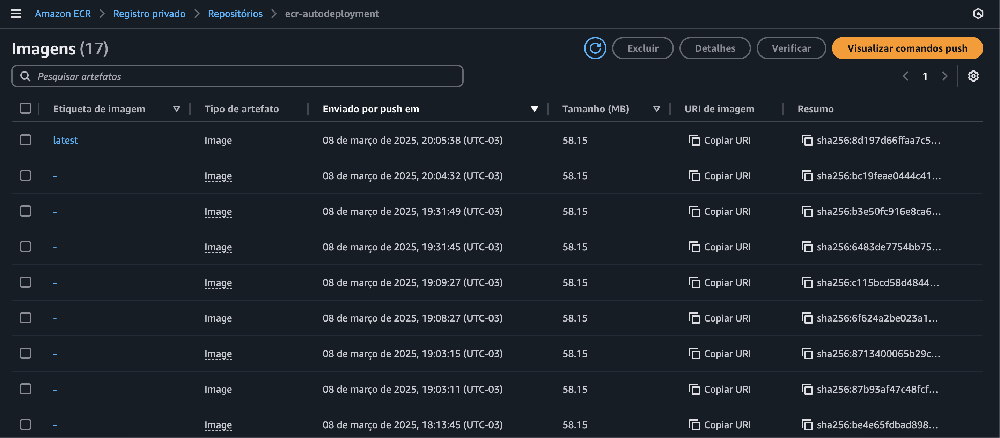

#### Orquestração: AWS ECS (Fargate)

##### Task overview

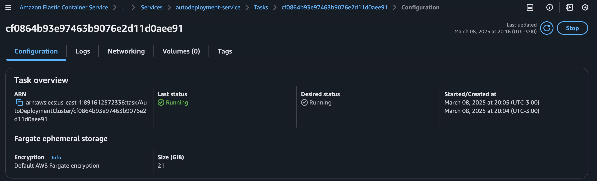

##### Configuration

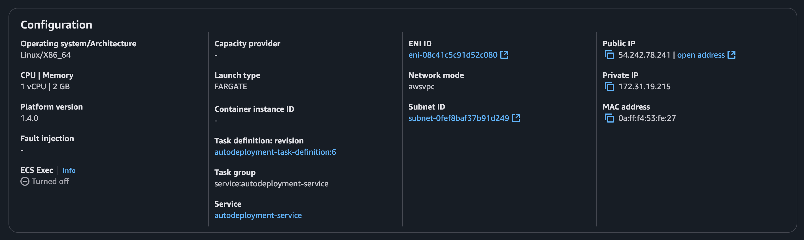

##### Containers

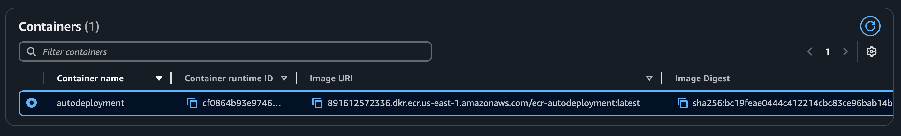

#### Implantação automatizada: AWS CodePipeline

##### Stage 1: Source

###### Resumo

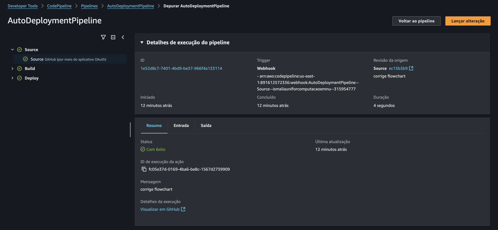

###### Entrada


###### Saída

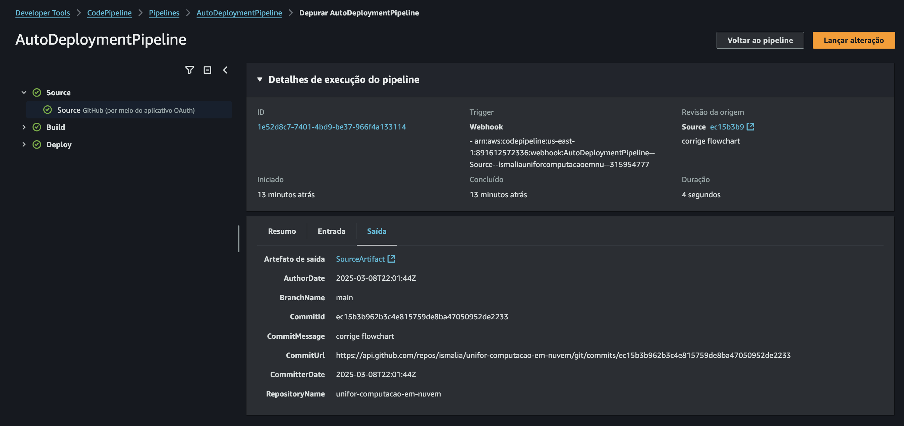

##### Stage 2: Build

###### Resumo

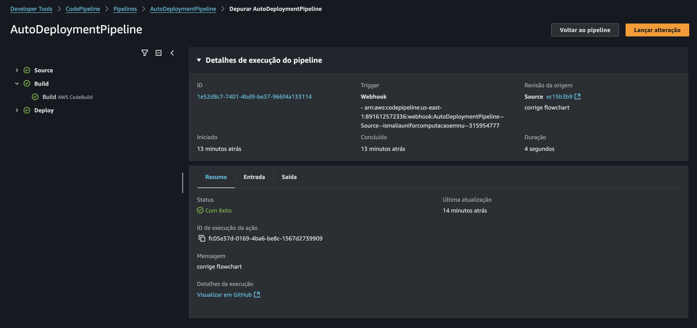

###### Entrada


###### Saída


##### Stage 3: Deploy

###### Resumo

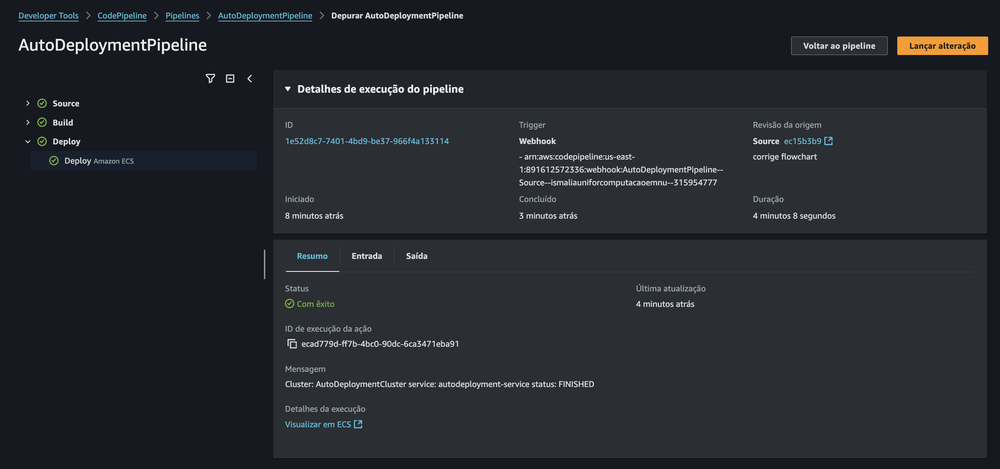

###### Entrada


###### Saída

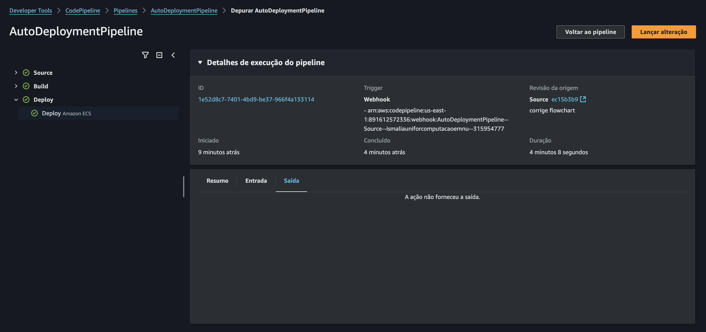

#### Monitoramento: CloudWatch Logs

###### Logs da aplicação

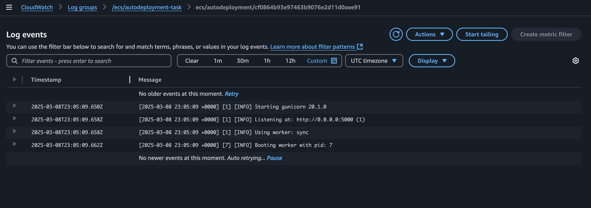

### Arquitetura

#### GitHub como repositório de código

O AWS CodeCommit não está mais disponível para novos clientes da AWS, então escolhemos o GitHub como nosso repositório por ser uma plataforma consolidada e confiável para versionamento de código. Ele facilita a colaboração entre nossa equipe. Além disso, por ser amplamente adotado, a curva de aprendizado para novos membros da equipe é mínima, e a compatibilidade com ferramentas da AWS é excelente.

#### AWS CodePipeline

O CodePipeline é o coração do nosso fluxo de CI/CD porque automatiza todo o processo, desde o commit no GitHub até a implantação final no AWS ECS. Com ele, conseguimos visualizar cada etapa do pipeline de forma clara, garantindo que os builds passem por todas as validações necessárias antes de serem implantados. Não usamos um estágio de teste em nosso pipeline, mas haveria também no serviço a possibilidade de adicionar gates de aprovação, o que nos daria controle sobre os lançamentos, garantindo que apenas versões testadas e revisadas cheguem à produção.

#### AWS CodeBuild

Focado no desenvolvimento da aplicação, sem preocupação com a manutenção de servidores de build, o CodeBuild atende perfeitamente, pois é totalmente gerenciado e escalável, ajustando automaticamente a capacidade conforme a demanda. Com isso, eliminamos problemas de infraestrutura e garantimos que os builds rodem de forma eficiente e sem gargalos, independentemente do volume de commits. Por exemplo: escolhemos como tipo de computação o EC2 para garantir a flexibilidade de executar o build com privilégios de root.

#### Amazon ECR (Elastic Container Registry)

Optamos pelo ECR para armazenar nossas imagens Docker porque queremos manter tudo dentro do ecossistema AWS, garantindo segurança, baixa latência e integração nativa com os outros serviços. Além disso, ele nos permite automatizar a verificação de vulnerabilidades e gerenciar o ciclo de vida das imagens, removendo versões antigas e otimizando custos. O uso de permissões via IAM também garante que apenas as pessoas e serviços certos tenham acesso às imagens, reforçando a segurança do nosso ambiente.

#### Amazon ECS (Elastic Container Service) com Fargate

Para a orquestração de contêineres, escolhemos o ECS com Fargate porque queremos simplicidade e eficiência. Em vez de termos que gerenciar servidores ou clusters Kubernetes, o Fargate cuida automaticamente da infraestrutura, provisionando e escalando os recursos conforme a demanda. Isso nos permite focar no desenvolvimento da aplicação, sem nos preocuparmos com a complexidade da infraestrutura. Além disso, como pagamos apenas pelos recursos que utilizamos, evitamos desperdício e otimizamos nossos custos operacionais.
