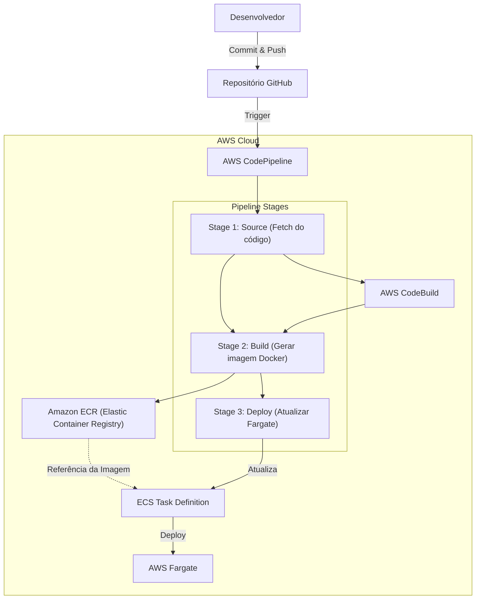

# [Unifor] Computação em Nuvem

## Descrição do fluxo CI/CD / Diagrama da arquitetura

## Arquitetura

### GitHub como Repositório de Código
- Escolhemos o GitHub como nosso repositório porque é uma plataforma consolidada e altamente confiável para versionamento de código. Ele facilita a colaboração entre nossa equipe. Além disso, por ser amplamente adotado, a curva de aprendizado para novos membros da equipe é mínima, e a compatibilidade com ferramentas da AWS é excelente.

### AWS CodePipeline
- O CodePipeline é essencial para nosso fluxo de CI/CD porque automatiza todo o processo, desde o commit no GitHub até a implantação final. Com ele, conseguimos visualizar cada etapa do pipeline de forma clara, garantindo que os builds passem por todas as validações necessárias antes de serem implantados. A possibilidade de adicionar gates de aprovação nos dá controle sobre os lançamentos, garantindo que apenas versões testadas e revisadas cheguem à produção.

### AWS CodeBuild
- Focado no desenvolvimento da aplicação, sem preocupação com a manutenção de servidores de build, o CodeBuild atende perfeitamente, pois é totalmente gerenciado e escalável, ajustando automaticamente a capacidade conforme a demanda. Com isso, eliminamos problemas de infraestrutura e garantimos que os builds rodem de forma eficiente e sem gargalos, independentemente do volume de commits. 

### Amazon ECR (Elastic Container Registry)
- Optamos pelo ECR para armazenar nossas imagens Docker porque queremos manter tudo dentro do ecossistema AWS, garantindo segurança, baixa latência e integração nativa com os outros serviços. Além disso, ele nos permite automatizar a verificação de vulnerabilidades e gerenciar o ciclo de vida das imagens, removendo versões antigas e otimizando custos. O uso de permissões via IAM também garante que apenas as pessoas e serviços certos tenham acesso às imagens, reforçando a segurança do nosso ambiente.

### Amazon ECS (Elastic Container Service) com Fargate
- Para a orquestração de contêineres, escolhemos o ECS com Fargate porque queremos simplicidade e eficiência. Em vez de gerenciar servidores ou clusters Kubernetes, o Fargate cuida automaticamente da infraestrutura, provisionando e escalando os recursos conforme a demanda. Isso nos permite focar no desenvolvimento da aplicação, sem nos preocupar com a complexidade da infraestrutura. Além disso, como pagamos apenas pelos recursos que utilizamos, evitamos desperdício e otimizamos nossos custos operacionais.
