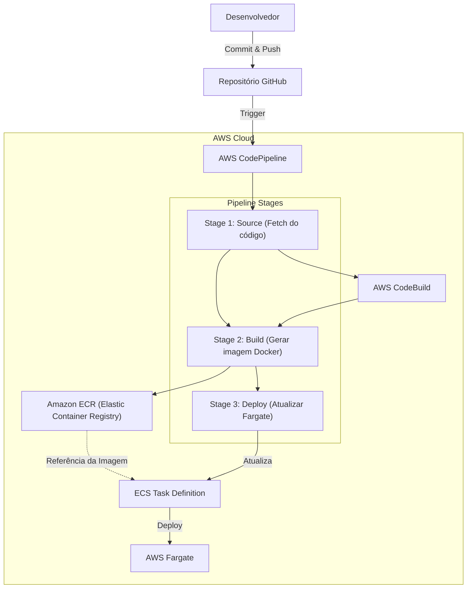
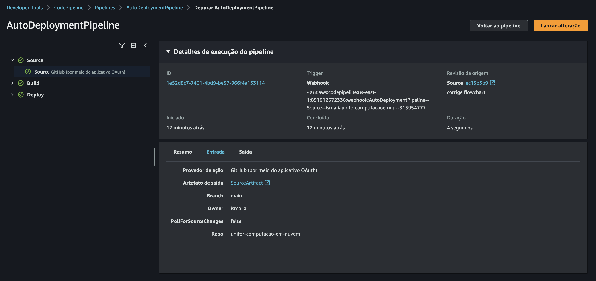
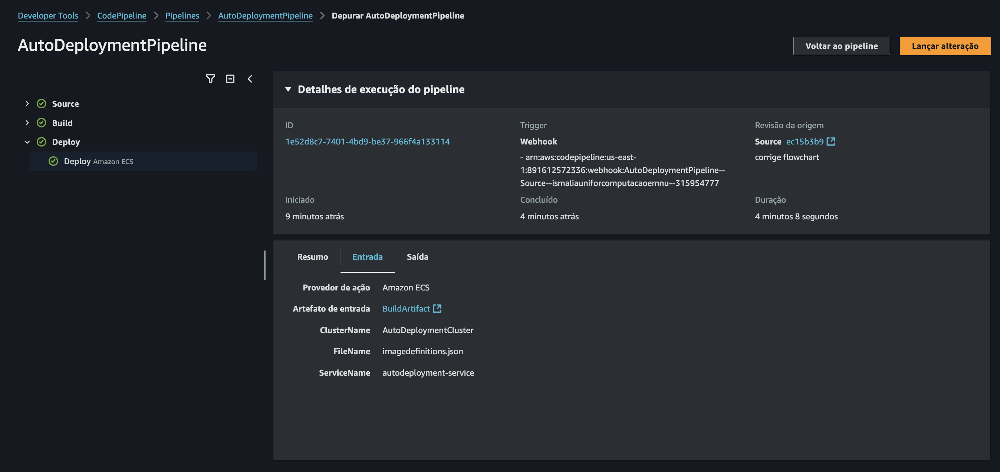

# [Unifor] Computação em Nuvem

Repositório dedicado à disciplina ***Computação em Nuvem***, ministrada pelo professor Marcondes Alexandre na Especialização em Engenharia de Software com DevOps, curso de pós-graduação lato sensu da Universidade de Fortaleza (UNIFOR).

## Atividade avaliativa

### Descrição do fluxo CI/CD / Diagrama da arquitetura

### Prints das configurações do pipeline

#### Stage 1: Source

##### Resumo

##### Entrada

##### Saída

#### Stage 2: Build

##### Resumo

##### Entrada

##### Saída

#### Stage 3: Deploy

##### Resumo

##### Entrada

##### Saída

### Arquitetura

#### GitHub como repositório de código

O AWS CodeCommit não está mais disponível para novos clientes da AWS, então escolhemos o GitHub como nosso repositório por ser uma plataforma consolidada e confiável para versionamento de código. Ele facilita a colaboração entre nossa equipe. Além disso, por ser amplamente adotado, a curva de aprendizado para novos membros da equipe é mínima, e a compatibilidade com ferramentas da AWS é excelente.

#### AWS CodePipeline

O CodePipeline é o coração do nosso fluxo de CI/CD porque automatiza todo o processo, desde o commit no GitHub até a implantação final no AWS ECS. Com ele, conseguimos visualizar cada etapa do pipeline de forma clara, garantindo que os builds passem por todas as validações necessárias antes de serem implantados. Não usamos um estágio de teste em nosso pipeline, mas haveria também no serviço a possibilidade de adicionar gates de aprovação, o que nos daria controle sobre os lançamentos, garantindo que apenas versões testadas e revisadas cheguem à produção.

#### AWS CodeBuild

Focado no desenvolvimento da aplicação, sem preocupação com a manutenção de servidores de build, o CodeBuild atende perfeitamente, pois é totalmente gerenciado e escalável, ajustando automaticamente a capacidade conforme a demanda. Com isso, eliminamos problemas de infraestrutura e garantimos que os builds rodem de forma eficiente e sem gargalos, independentemente do volume de commits. Por exemplo: escolhemos como tipo de computação o EC2 para garantir a flexibilidade de executar o build com privilégios de root.

#### Amazon ECR (Elastic Container Registry)

Optamos pelo ECR para armazenar nossas imagens Docker porque queremos manter tudo dentro do ecossistema AWS, garantindo segurança, baixa latência e integração nativa com os outros serviços. Além disso, ele nos permite automatizar a verificação de vulnerabilidades e gerenciar o ciclo de vida das imagens, removendo versões antigas e otimizando custos. O uso de permissões via IAM também garante que apenas as pessoas e serviços certos tenham acesso às imagens, reforçando a segurança do nosso ambiente.

#### Amazon ECS (Elastic Container Service) com Fargate

Para a orquestração de contêineres, escolhemos o ECS com Fargate porque queremos simplicidade e eficiência. Em vez de termos que gerenciar servidores ou clusters Kubernetes, o Fargate cuida automaticamente da infraestrutura, provisionando e escalando os recursos conforme a demanda. Isso nos permite focar no desenvolvimento da aplicação, sem nos preocuparmos com a complexidade da infraestrutura. Além disso, como pagamos apenas pelos recursos que utilizamos, evitamos desperdício e otimizamos nossos custos operacionais.
